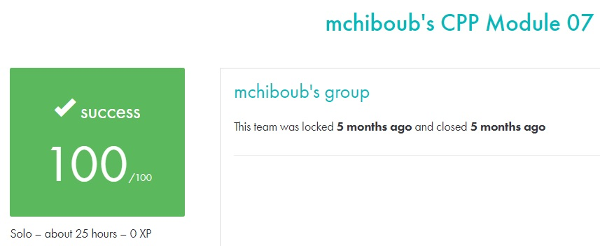

# C++ module 07 #

## What the project does: ##
The C++ - Module 07 project focuses on C++ templates. It includes exercises that teach how to implement and use function and class templates. The project covers creating template functions like swap, min, and max, applying a function to each element in an array using templates, and building a templated Array class.

## Why the project is useful: ##
This project is useful because it introduces the powerful concept of templates, which allows for generic programming in C++. Templates enable you to write flexible and reusable code that works with any data type, improving code efficiency and reducing redundancy, essential for modern software development.

[Subject of this project](en.subject.pdf)